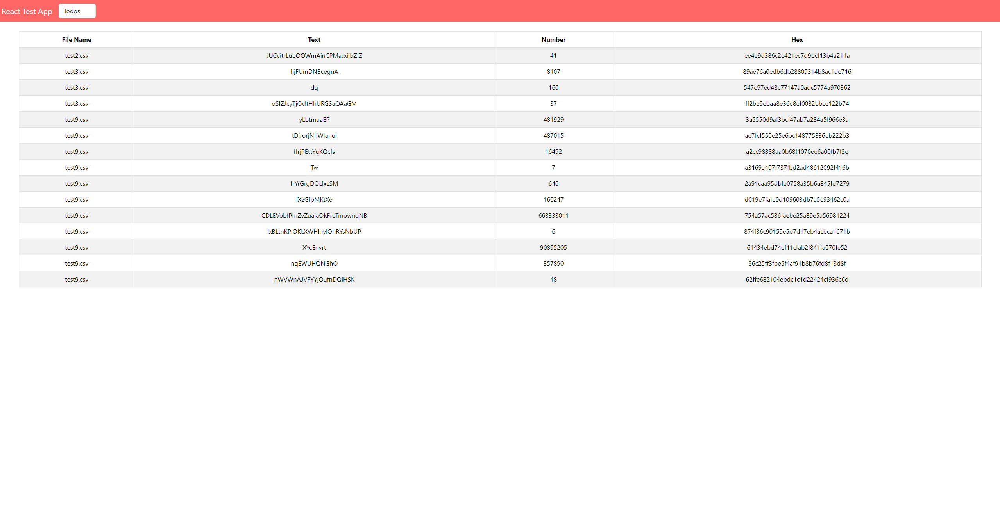

# Toolbox-Challenge

<p>
  
</p>

## Technologies used:

- Javascript
- React
- Bootstrap
- Redux
- Node
- Express
- Docker

## Instruccions to run this project with Docker.

### Backend

```javascript
npm install
```

### Frontend

```javascript
npm install
```

### Root

```javascript
docker-compose up
```

### See the project at http://localhost:3000/

## Instruccions to run this project locally.

### Backend

```javascript
npm install
```

```javascript
npm start
```

### Frontend

```javascript
npm install
```

```javascript
npm start
```